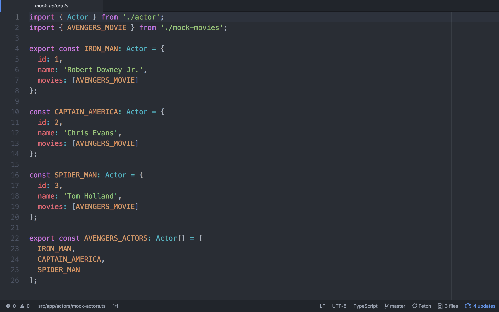
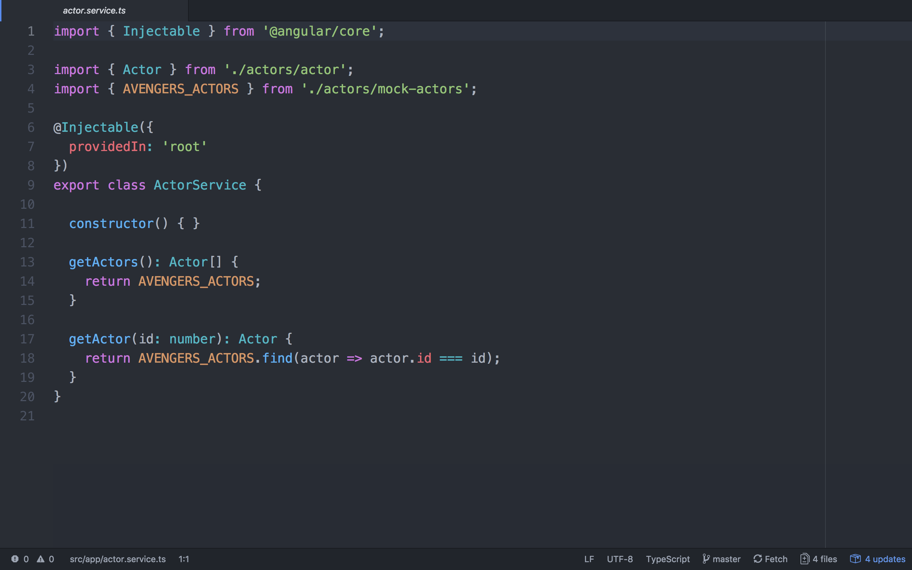
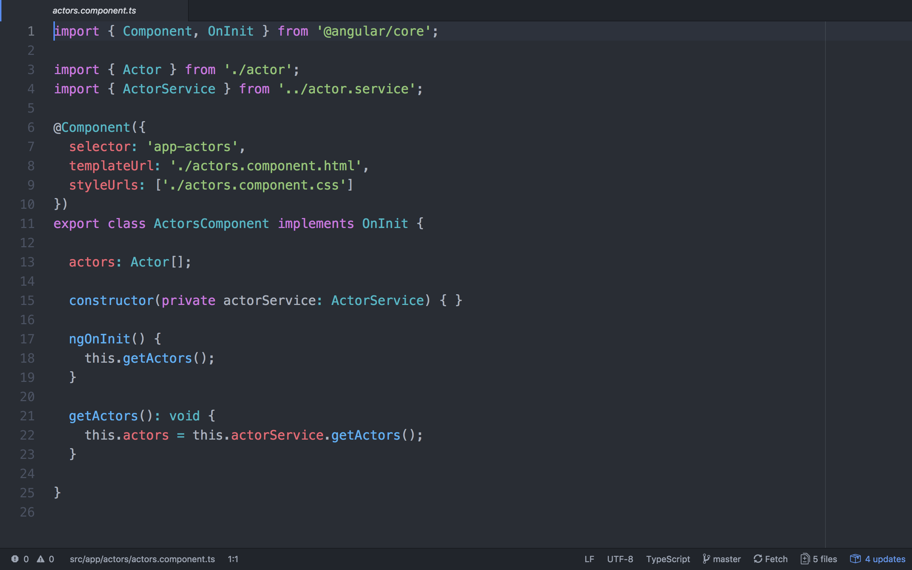
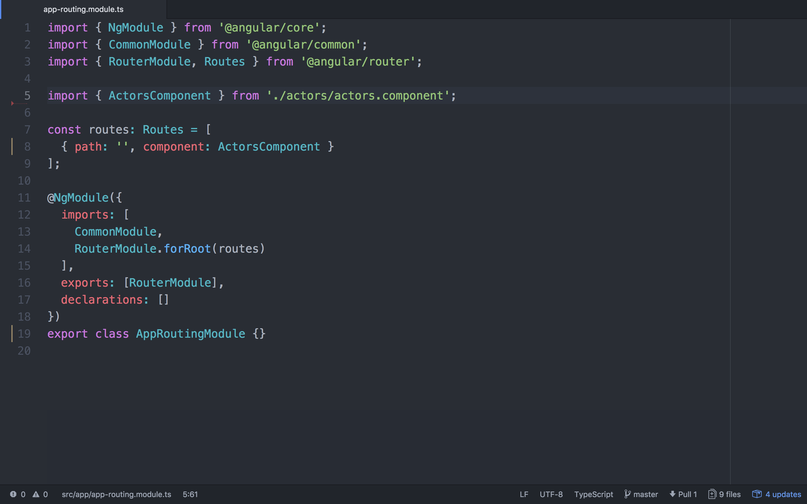
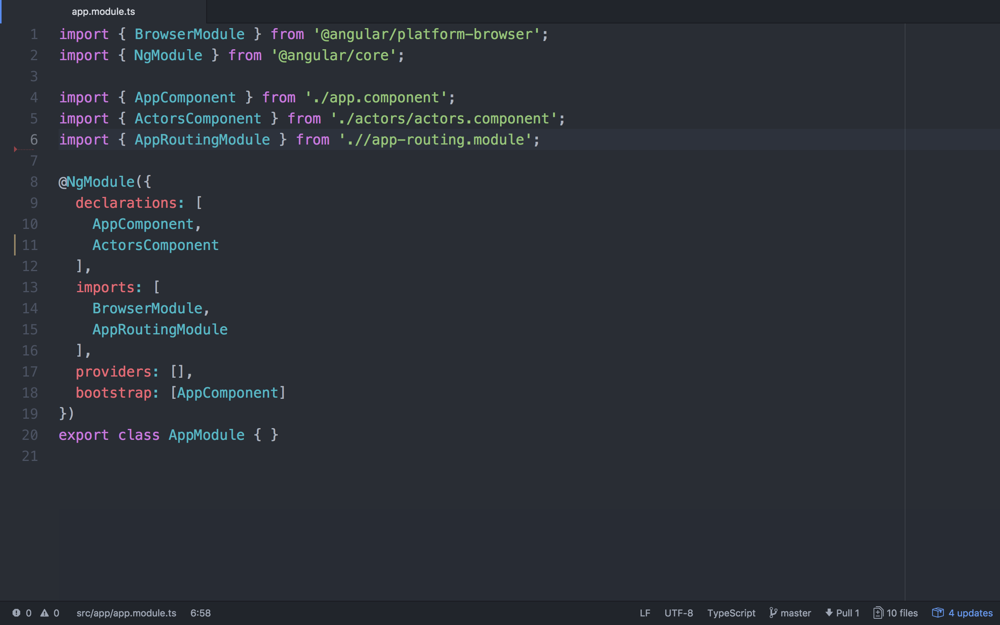
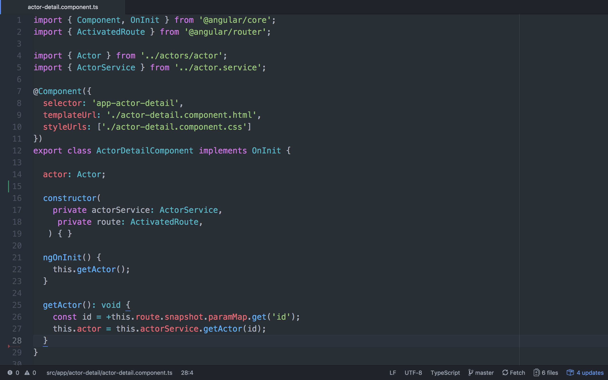

# MovieTrailerApp

This project was generated with [Angular CLI](https://github.com/angular/angular-cli) version 6.0.7.


## How to add Actor Routing

### Add id to Actor class
First, we need to add an id to Actos class and to each Actor to make sure each Actor has a unique attribute (we'll use this to locate each Actor).


**actor.ts**

### Create Actor Service
Since we're going to need the actors in multiple components, we should have a common way of retrieving actors. This is what a service does. Read more about services in the [Angular Documenation](https://angular.io/guide/architecture-services)

Create a service using Angular CLI

`ng generate service actor`

You should have an `actor.service.ts` in your app folder.

You need to create two functions `getActors` and `getActor`. These will be the two functions you use in other components.



#### getActor explanation

The function on Line 18 may be a bit confusing. If you look at the documentation for [find](https://developer.mozilla.org/en-US/docs/Web/JavaScript/Reference/Global_Objects/Array/find) you'll see that find takes a function as a parameter that will define what it's looking. Instead of writing a complete function we can write shorthand.

`actor => actor.id === id`

means the same as 

```javascript
function(actor) {
  return actor.id === id; 
}
```

The find function will go through the array and return the first value in the array that matches the function. 

**Note:** The variable name can be anything, as long as you're consistent. I used the variable name actor because it's an array of Actor objects but it could just as easily have been `element` or `item`.

### Change Actors Component to use Actor Service

Now that we have an Actor service, let's test it using our Actors. Change your `actor.component.ts` to look like this:


**actors.component.ts**

Angular utilizes [Dependency Injection](https://angular.io/guide/dependency-injection) to make it incredibly easy to utilize other classes in a class. 

Test your webpage and make sure your actor still shows up

### Add Default Routing

Since we're going to be navigating between components let's set up routing to be able to switch between components.

Let's create our routing module using Angular CLI

`ng generate module app-routing --flat --module=app`

```
--flat puts the file in src/app instead of its own folder.
--module=app tells the CLI to register it in the imports array of the AppModule.
```

Now let's set up our `app-routing.module.ts` and `app.module.ts` to support routing.


**app-routing.module.ts**


**app.module.ts**

Since we set the default path to be the actors component you should still see your same page. 

### Add an Actor Detail Component

The final step is to add the actor detail page and set up routing for it. 

Use Angular CLI to generate the actor-detail component 

`ng generate component actor-detail`

Then set up your HTML and your ts files

Update your `actor-detail.component.html` to look like:

```html
<h2>{{actor.name}}</h2>
<ul>
  <li *ngFor="let movie of actor.movies">
    <a href="{{movie.trailerURL}}">{{movie.name}}</a>
  </li>
</ul>
```

Your `actor-detail.component.ts` will look like:


**actor-detail.component.ts**

#### Breaking down the actor-detail getActor method 

Let's look at getActor:

```javascript
getActor(): void {
  const id = +this.route.snapshot.paramMap.get('id');
  this.actor = this.actorService.getActor(id);
}
```

`void` means this function doesn't output anything, it's simply setting the actor variable to be used in our HTML page. 

`const` means this is variable is constant and cannot be changed. We set the id by grabbing it out of the path to the actor (e.g. localhost:4200/detail/1) and then we use the + to convert it to an integer. 

`this.actor` means use the class variable actor. This just tells the program to look outside of the function for the variable actor. 

### Final Step: Add Routing to Actor Detail component. 

The final step is to set up your page so that when you click on an Actor you go to that Actor's page and display their information. 

#### Add a path to App Routing Module

Adjust your routes variable in `app-routing.module.ts`

```javascript
const routes: Routes = [
  { path: '', component: ActorsComponent },
  { path: 'detail/:id', component: ActorDetailComponent }
];
```

This makes a path to display a specific actor. 

You will also need to import your `ActorDetailComponent`

Finally, adjust your `actors.component.html` to be:

```html
<div *ngFor="let actor of actors">
  <a routerLink="/detail/{{actor.id}}"><h3>{{actor.name}}</h3></a>
</div>
```

Which will set up each actor to link to their actor detail page. 

Test your page. Compare your code to the code in this repository if there are any errors.

## Development server

Run `ng serve` for a dev server. Navigate to `http://localhost:4200/`. The app will automatically reload if you change any of the source files.

## Code scaffolding

Run `ng generate component component-name` to generate a new component. You can also use `ng generate directive|pipe|service|class|guard|interface|enum|module`.

## Build

Run `ng build` to build the project. The build artifacts will be stored in the `dist/` directory. Use the `--prod` flag for a production build.

## Running unit tests

Run `ng test` to execute the unit tests via [Karma](https://karma-runner.github.io).

## Running end-to-end tests

Run `ng e2e` to execute the end-to-end tests via [Protractor](http://www.protractortest.org/).

## Further help

To get more help on the Angular CLI use `ng help` or go check out the [Angular CLI README](https://github.com/angular/angular-cli/blob/master/README.md).
